# DVSA Earlier Slot Watcher

A Tampermonkey userscript for UK learner drivers with an **existing DVSA practical driving test booking**. Watches the "Change your test" page for earlier cancellation slots at your test centre, alerts when one appears in your accepted date window, and can optionally auto-reschedule up to DVSA's final confirmation step.

**Does not book new tests**, you must already have a confirmed booking.

  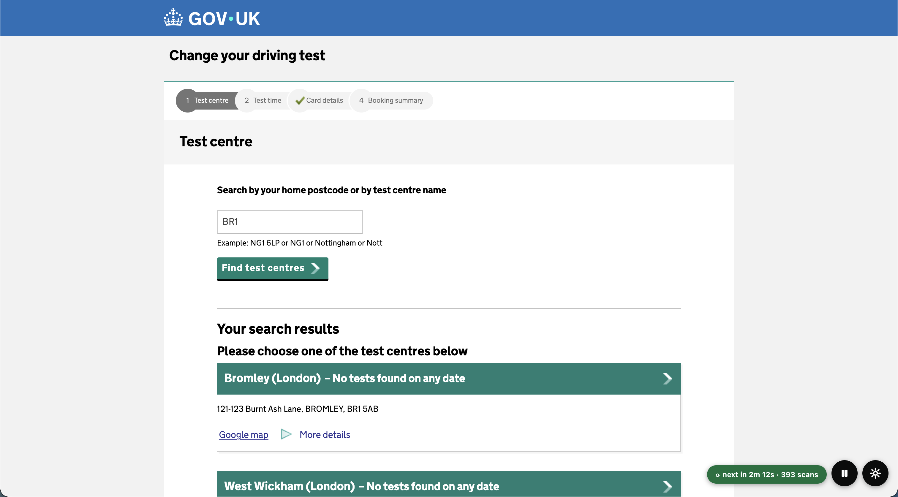

> [!WARNING]
> Unofficial community tool. No affiliation with DVSA, gov.uk, or the UK Government. No warranty, no liability for missed slots or account issues. By installing you accept the terms in **[DISCLAIMER.md](DISCLAIMER.md)**. Full legal and permitted-use details: [Before you install](#before-you-install).

---

## What it does

For users with an existing DVSA test booking who want to reschedule earlier:

- **Monitors** the "Change your test" page on a randomised 7-12 minute cycle (configurable 5-60).
- **Filters** by date window, weekends, and your instructor's unavailable dates.
- **Alerts** four ways at once: red banner, browser notification, audio chime, tab-title flash.
- **Auto-books (opt-in)** through to DVSA's "Confirm changes" page, the final commit stays manual.
- **Logs every finding** to local browser storage. Filter, group, export to CSV.
- **Stays 100% local**, no analytics, no telemetry, no external network calls beyond DVSA itself.

  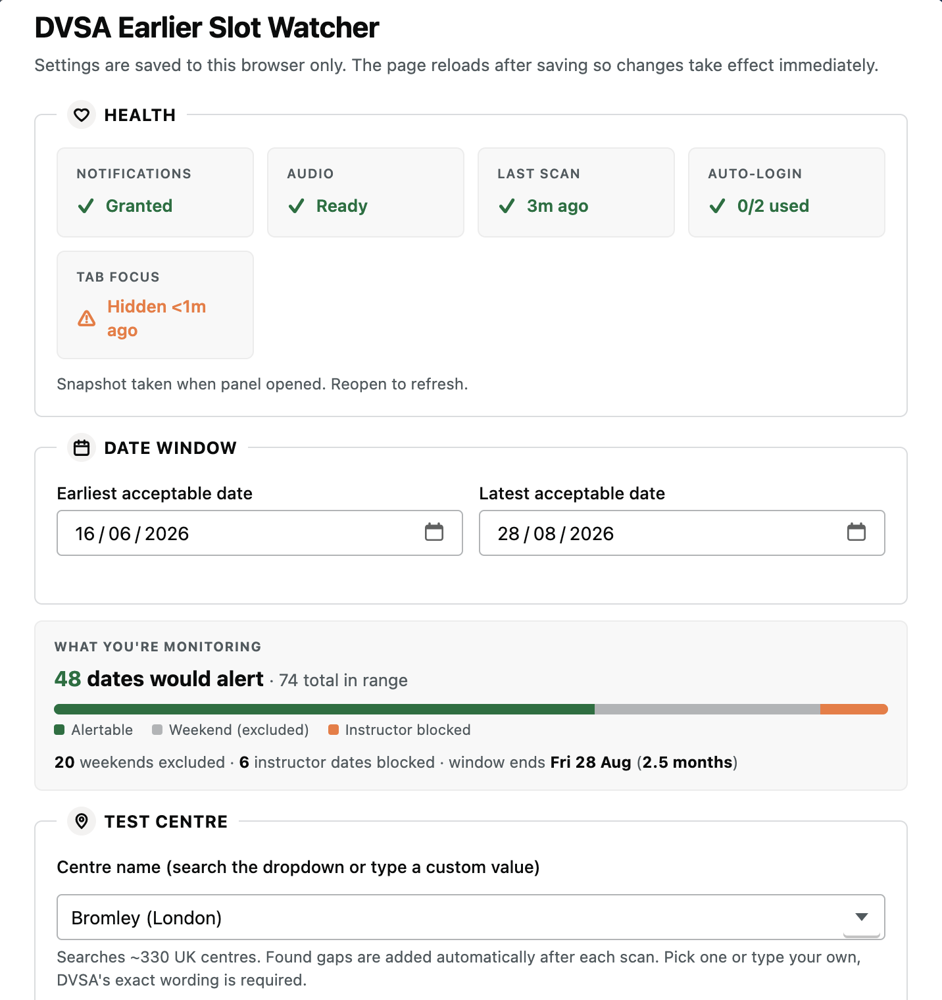
   
  The in-page settings panel. Everything's configured here, no code editing required.

---

## Quick start

The 60-second version. Full walkthrough in [Install](#install).

1. Install [Tampermonkey](https://www.tampermonkey.net/) for your browser.
2. Click to install the script: **[DVSA Earlier Slot Watcher](https://raw.githubusercontent.com/alchemycharlie/dvsa-earlier-slot-watcher/main/dvsa-slot-watcher.user.js)**
3. **Chromium browsers only:** enable Tampermonkey's "Allow User Scripts" toggle ([why](#chromium-allow-user-scripts)).
4. Open [your DVSA booking page](https://driverpracticaltest.dvsa.gov.uk/manage) and log in.
5. The setup wizard appears. Walk through it. Save. Leave the tab open.

Press `S` for settings, `H` for history, `P` to pause.

---

## Install

### 1. Install Tampermonkey

[Tampermonkey](https://www.tampermonkey.net/) is the userscript manager (browser extension).

- [Chrome / Brave / Edge](https://chromewebstore.google.com/detail/tampermonkey/dhdgffkkebhmkfjojejmpbldmpobfkfo)
- [Firefox](https://addons.mozilla.org/firefox/addon/tampermonkey/)
- [Safari (paid)](https://apps.apple.com/app/tampermonkey/id1482490089)

### 2. Chromium browsers: enable "Allow User Scripts" 

> [!IMPORTANT]
> Since Chrome's Manifest V3 enforcement tightened, Chromium browsers require you to explicitly opt in to running userscripts. Without this step, Tampermonkey can install the script but won't run it on DVSA pages.

1. Open your browser's extensions page (`chrome://extensions/`, `edge://extensions/`, `brave://extensions/`, etc.).
2. Toggle **Developer mode** ON (top-right).
3. Click **Details** on the Tampermonkey card.
4. Toggle **Allow User Scripts** ON.

Official Tampermonkey guidance: <https://www.tampermonkey.net/faq.php?q=Q209>.

**Firefox users:** skip this step.

### 3. Install the script

Click in a browser with Tampermonkey installed: **[Install DVSA Earlier Slot Watcher](https://raw.githubusercontent.com/alchemycharlie/dvsa-earlier-slot-watcher/main/dvsa-slot-watcher.user.js)**

Tampermonkey opens its install screen. Click **Install**. It'll auto-update from the same URL on future releases.

### 4. Configure

1. Open <https://driverpracticaltest.dvsa.gov.uk/manage> and log in.
2. **First-time:** the 5-step setup wizard appears. **Returning:** click the gear icon (bottom-right) any time.
3. Fill in (wizard or panel):
   - Date window (earliest + latest acceptable dates)
   - Test centre (searchable dropdown, ~330 UK centres bundled)
   - Search term (postcode or centre name DVSA recognises)
   - Instructor unavailable dates (optional, paste or pick)
   - Auto-book (optional, off by default)
   - Auto-login (optional, paste licence + booking ref for session recovery)
4. Click **Save and reload** / **Finish setup**.
5. Leave the tab open. The script does the rest.

<strong>The first-run setup wizard</strong>

<table align="center">
  <tr>
    <td align="center" valign="top" width="33%">
      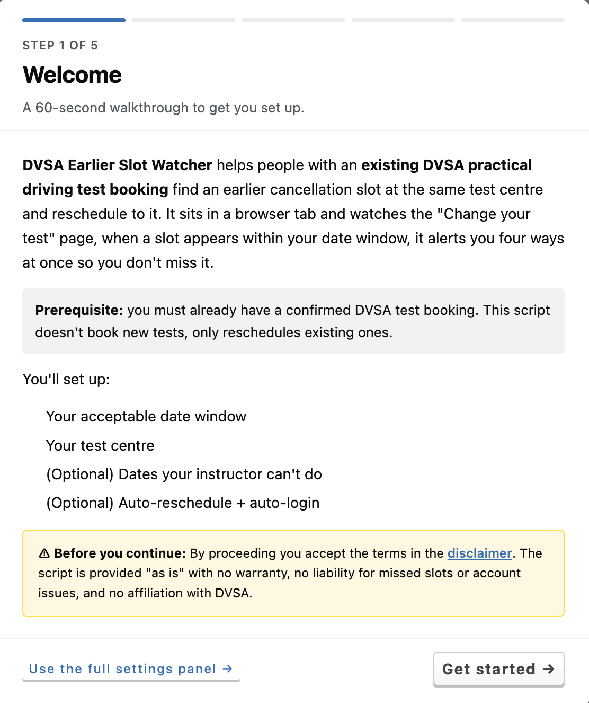
       Step 1: Welcome &amp; disclaimer
    </td>
    <td align="center" valign="top" width="33%">
      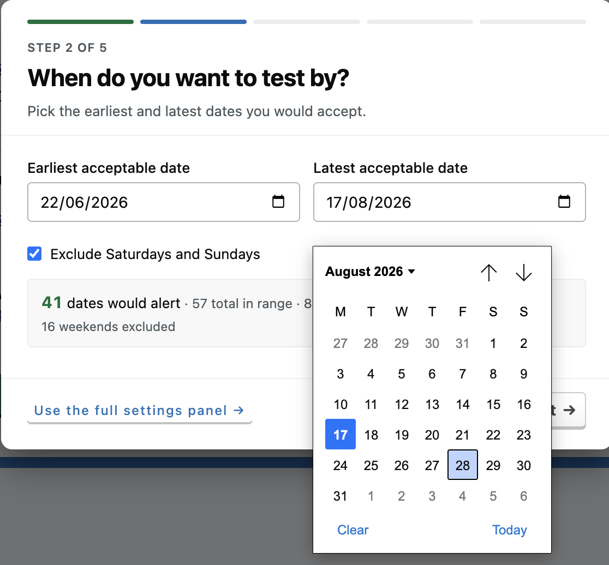
       Step 2: Date window with live preview
    </td>
    <td align="center" valign="top" width="33%">
      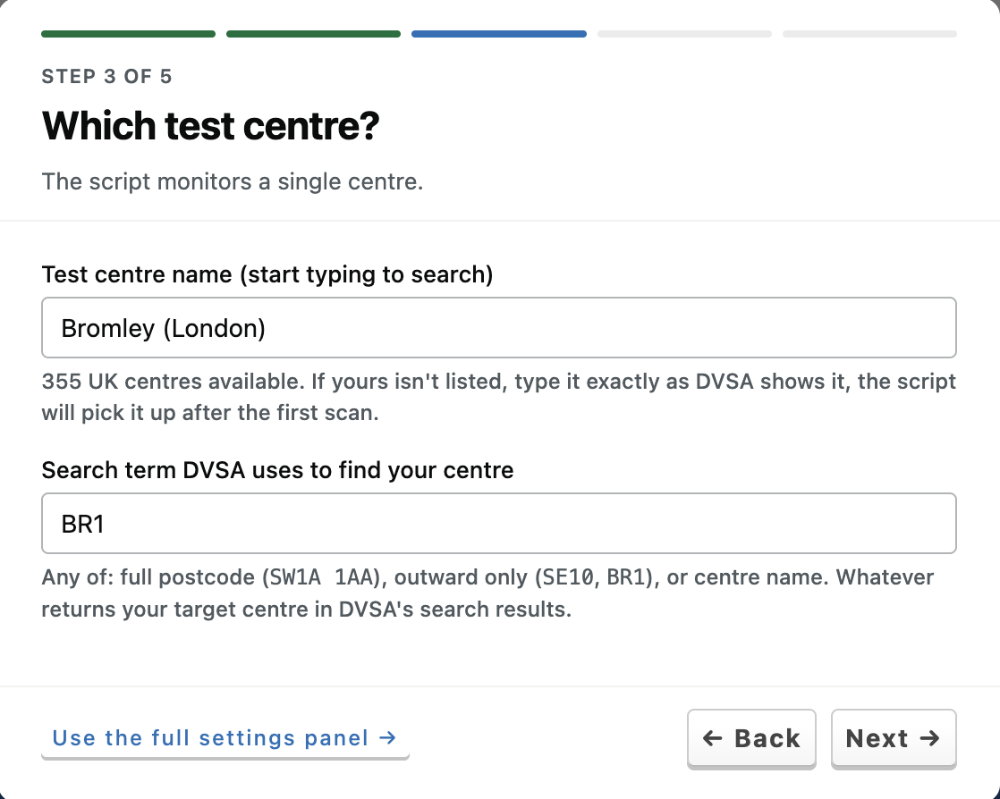
       Step 3: Test centre + search term
    </td>
  </tr>
</table>

Steps 4 and 5 cover instructor dates and final options (refresh interval, auto-book opt-in, auto-login). Both are skippable.

  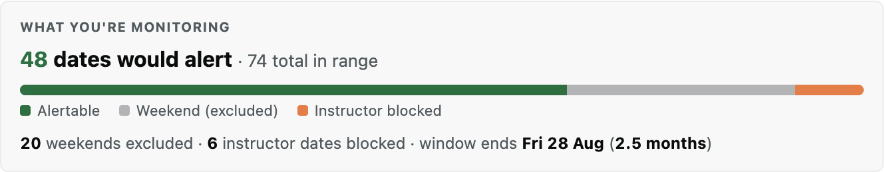
   
  "What you're monitoring" updates live as you tune the date window, weekend toggle, and instructor dates.

  
   
  Status pill: current state + countdown to next refresh.

---

## Troubleshooting

### Installed but nothing happens on DVSA pages (Chromium browsers)

The **Allow User Scripts** toggle isn't on. See [step 2 of Install](#2-chromium-browsers-enable-allow-user-scripts).

Then reload the DVSA tab, the floating pill and gear should appear bottom-right.

Firefox users: this isn't required. Check the script is enabled in Tampermonkey's dashboard.

### Notifications aren't firing

Most likely:

1. **Permission denied**, Settings → Health card → Notifications. If "Denied", re-grant in your browser's site settings (padlock icon).
2. **Focus/DND mode**, macOS Focus, Windows Focus Assist, and Do Not Disturb modes swallow notifications. Whitelist the browser or disable.
3. **Notifications unsupported**, locked-down browsers or in-app webviews. Use a desktop browser.

### Audio chime isn't playing

Web Audio needs a user gesture before it can play. Click anywhere on the page once. Health card should show **Audio: Ready**. Use **Test alert** to verify.

### Error 15 / temporary block

DVSA returns "Error 15" when too many requests arrive from your IP. The script recognises this, pauses, and surfaces an intervention banner. Usually clears within 1-2 hours.

Common causes:

- Refresh interval set faster than the 7-12 min default.
- Script running in multiple tabs/browsers/devices simultaneously.
- Other traffic from your IP also hitting DVSA.

Wait for the block to clear, then resume. Full rationale for how the script behaves here: [docs/SECURITY-POSTURE.md](docs/SECURITY-POSTURE.md#error-15--temporary-rate-limit-block).

  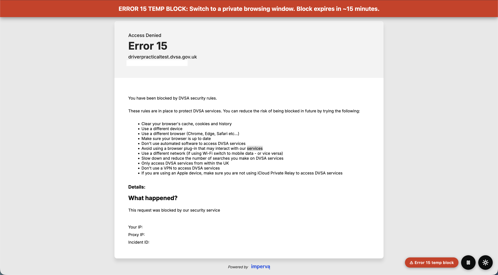

### CAPTCHA appeared

DVSA occasionally presents a CAPTCHA. The script recognises it, pauses, and hands control back. Complete it yourself; the script resumes on the next cycle. If CAPTCHAs appear every cycle, increase the refresh interval to 15-30 min and wait a few hours.

Full rationale for how the script behaves here: [docs/SECURITY-POSTURE.md](docs/SECURITY-POSTURE.md#captcha-challenges).

  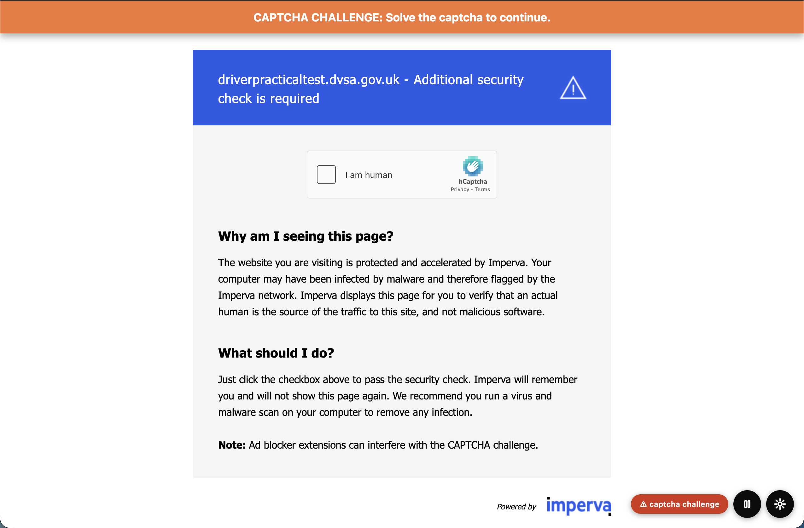

### "Layout broken" intervention

DVSA changed page structure. The script bails rather than clicking the wrong thing.

1. Check for a script update: Tampermonkey dashboard → **Check for updates**.
2. If you're on the latest version, [file an issue](https://github.com/alchemycharlie/dvsa-earlier-slot-watcher/issues/new/choose) with the body ID DVSA is now using and which selector broke.

### "Test centre mismatch" intervention

The H1 on the DVSA calendar page doesn't match your configured centre. Either:

- You typed the name slightly differently, open settings, pick from the dropdown.
- DVSA renamed the centre, pick from the dropdown again.
- You navigated to the wrong centre via DVSA's own search.

  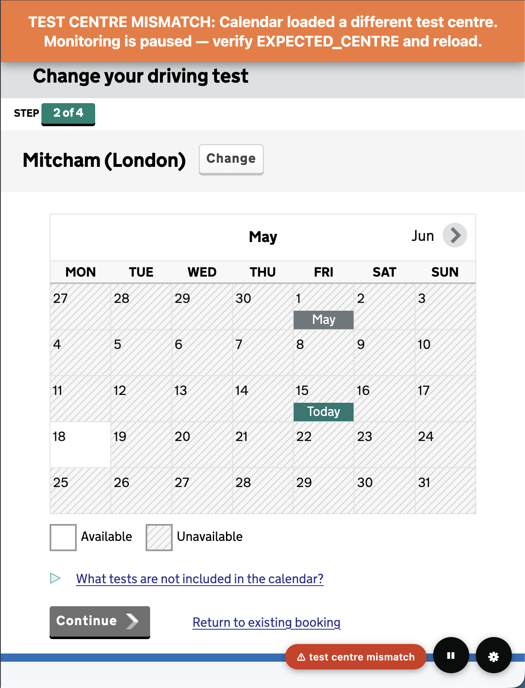

### Can't see the floating cluster

Possible blockers:

- A browser extension overlay (translator, password manager) at the same position, toggle extensions.
- Zoom above 200%, the cluster may be off-screen. Zoom back.
- Ancestor CSS transform in DVSA's markup (rare, the cluster uses a single container to dodge this).

### Status pill says "configure to start" but values are filled in

Validation is failing somewhere. Open settings: offending fields have red rings. Common causes:

- Start date > end date.
- Auto-book time window with earliest > latest.
- Search term shorter than 2 chars, or still on the `AA1 1AA` placeholder.
- Test centre still on `Your Test Centre (Location)` placeholder.

### Auto-book clicked the wrong slot

Toggle **Test mode** on in settings → reload → verify the script reads the calendar correctly → turn Test mode off. If it persists, [file an issue](https://github.com/alchemycharlie/dvsa-earlier-slot-watcher/issues/new/choose) with the body ID, console snippet, and a calendar screenshot.

Per the [DISCLAIMER](DISCLAIMER.md), you remain solely responsible for verifying the slot before clicking Confirm changes. Auto-book stops short of that final click on purpose.

---

## FAQ

**Does this book new tests for me?**
No. It only operates inside DVSA's "Change your test" management flow (`/manage*`). You must already have a confirmed booking.

**Is this legal?**
The script automates clicks you'd otherwise make manually on the management section of DVSA's site, using your own login, for your own booking. Whether your specific use complies with DVSA's terms is your responsibility. See [DISCLAIMER.md](DISCLAIMER.md). Seek independent legal advice if unsure.

**Will it work for HGV, motorcycle, or other test types?**
No, the script's `@match` rules target the car practical flow only (`driverpracticaltest.dvsa.gov.uk/manage*`). Other test types use different subdomains and pages. Contributions welcome.

**Does it work on mobile?**
Mobile is untested and unsupported. The UI is sized for desktop.

**Can I run multiple tabs / instances?**
No. They'd refresh independently and trip DVSA's rate limit (Error 15).

**Can I run this on a Raspberry Pi or server?**
No. The script is designed for an attended desktop browser tab. Headless or server-side use is out of scope.

**How do I update?**
Tampermonkey auto-updates from the `@updateURL`. Force an update: dashboard → script row → **Check for updates**. Saved settings are preserved.

**Why doesn't it auto-click the final Confirm button?**
DVSA holds the slot for 15 minutes once you reach Confirm. With one wasted reschedule possibly meaning months until the next opportunity, the human-in-the-loop gate is intentional. See [DISCLAIMER §11](DISCLAIMER.md#11-auto-book-feature-specific-waiver).

**How do I share my config without sharing credentials?**
Settings → **Backup & restore**. The "Include auto-login credentials in export" checkbox is **off by default** specifically for this. Shared JSON files have blank licence/booking-ref fields.

**Can I disable auto-book once enabled?**
Yes. Settings → uncheck **Auto-book through to the confirmation page** → Save. Falls back to alert-only mode immediately.

**Fastest way to add my instructor's unavailable dates?**
Settings → Instructor unavailable dates → **Paste multiple…** → paste one date per line (e.g. `2026-05-26`). Invalid lines are silently skipped.

---

## Privacy

- **Nothing is sent to me or anyone else.** No analytics, no telemetry, no error reporting.
- **All settings live in `localStorage`** in your own browser. Clearing browser data wipes them.
- **Scan history lives in `localStorage` too.** Export to CSV from the History panel.
- **Auto-login credentials are optional and local-only.** They're sent only to DVSA's login form, same as if you typed them.
- **No external CDNs, fonts, or scripts.** One self-contained `.user.js` file. Read it before installing if you want.

The only network calls the script triggers are the ones you'd make manually on the DVSA site.

---

## Auto-book safety

Auto-book is **opt-in** and disabled by default. When enabled:

1. Clicks the matching date on the calendar.
2. Clicks an available time slot within your accepted time window.
3. Clicks **Continue** on DVSA's "Warning! You'll lose your current booking" modal.
4. **STOPS** on the "Confirm changes" review page.

The final Confirm click stays manual. DVSA holds the slot for 15 minutes at that point, giving you time to verify date, time, and centre. While holding, the script:

- Flashes the page title with a red countdown.
- Pulses the Confirm button with a yellow highlight.
- Refuses to ever click Confirm or Abandon automatically.

If you're not comfortable with auto-book, leave it off. The alerts still fire so you can complete manually.

  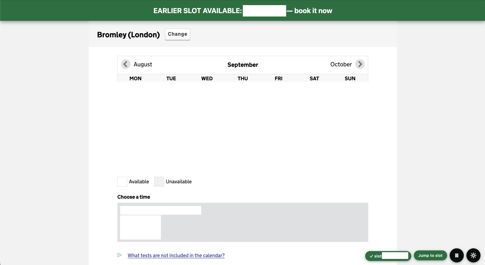

  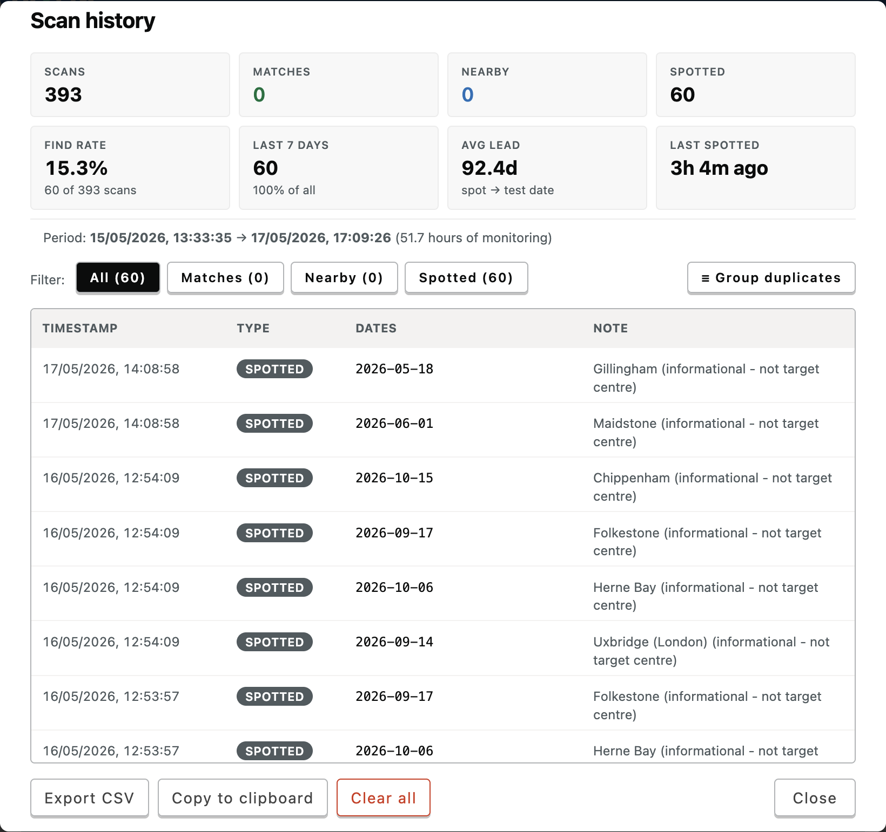
   
  Every match, nearby alert, and spotted date is logged locally.

---

## Configuration tips

- **Don't go below 5-minute cycles.** Faster requests place unnecessary load on DVSA and trip Error 15. The 7-12 min default is comparable to a person checking the page periodically.
- **Keep the tab focused if you can.** Background tabs get `setTimeout` throttling, which stretches cycles.
- **Use Test mode to verify alerts.** Toggle it on, next scan fires a fake alert. Don't forget to turn it off.
- **Allow notifications.** Without them the only alert is in the tab itself.

---

## Before you install

This section consolidates the legal and acceptable-use terms. Full versions are in [DISCLAIMER.md](DISCLAIMER.md).

### Unofficial and unwarranted

This is a free, unofficial, community-built tool. **Not affiliated with, endorsed by, or connected to the DVSA, gov.uk, or the UK Government** in any way.

By installing or using this script you accept:

- **No warranty.** "As is", "as available", no guarantees.
- **No liability** on the author for missed slots, lost bookings, account issues, incorrect bookings, missed alerts, or any other consequence.
- **You are solely responsible** for complying with DVSA's terms and for verifying every booking detail before clicking Confirm.

Full terms: **[DISCLAIMER.md](DISCLAIMER.md)**. If you don't accept them, do not install.

### Existing bookings only

The script is for people with an **existing, paid, confirmed** DVSA practical driving test booking who want to find an earlier cancellation slot at the same test centre and reschedule.

What it exists to do: remove the manual effort of repeatedly refreshing the "Change your test" page.

What it will not do:

- Book a new test from scratch.
- Skip the DVSA application or payment flow.
- Snap up newly-released slots before they reach DVSA's public booking page.
- Circumvent, evade, or interfere with DVSA's security measures.

The script only operates on `driverpracticaltest.dvsa.gov.uk/manage*` and `/login*`. It never touches the fresh-booking application URL. For the full treatment of how the script behaves around CAPTCHA, rate limits, page-structure changes, and session expiry, see [docs/SECURITY-POSTURE.md](docs/SECURITY-POSTURE.md).

### Permitted use

For **individual personal use only**, by people in the UK who hold their own DVSA practical driving test booking and wish to reschedule to an earlier date.

**Not permitted:**

- Use on behalf of any other person (friends, family, pupils, clients).
- Use across multiple DVSA accounts.
- Commercial use of any kind. Driving instructors and schools must not run the script on behalf of pupils.
- Use for malicious or unlawful purposes, or anything that breaches DVSA terms, DVLA terms, the Computer Misuse Act 1990, or any other applicable UK law.
- Wrapping the script inside headless browsers, automation frameworks, or unattended server-side automation.
- Use outside the UK.

The script is, and will remain, free for genuine individual users. It must not be copied, modified, redistributed, or forked for financial gain. Forks intended to break, weaponise, or maliciously alter the script's behaviour are not endorsed by the author.

Full details: [DISCLAIMER §3 (Acceptable Use)](DISCLAIMER.md#3-acceptable-use-policy), [§4 (Distribution and Forks)](DISCLAIMER.md#4-distribution-modification-and-forks), [§5 (Project Philosophy)](DISCLAIMER.md#5-project-philosophy).

By completing installation and saving any configuration, you confirm that you have read and accepted the terms in [DISCLAIMER.md](DISCLAIMER.md).

---

## Contributing

Issues and PRs welcome. Use the templates in [.github/ISSUE_TEMPLATE](.github/ISSUE_TEMPLATE/).

For bug reports, please include:

- Tampermonkey version and browser.
- Console log snippet (`[DVSA Earlier Slot Watcher]` lines).
- The DVSA page state when it happened.

---

## Support

Free, open source, and ad-free. If it's helped you find an earlier test date, a coffee is appreciated.

---

## License

- **Code:** MIT, see [LICENSE](LICENSE).
- **Disclaimer and limitation of liability:** [DISCLAIMER.md](DISCLAIMER.md). Installing or using the Software constitutes acceptance in full.

Independent, unofficial tool. Not affiliated with the DVSA, the UK Government, or gov.uk.
